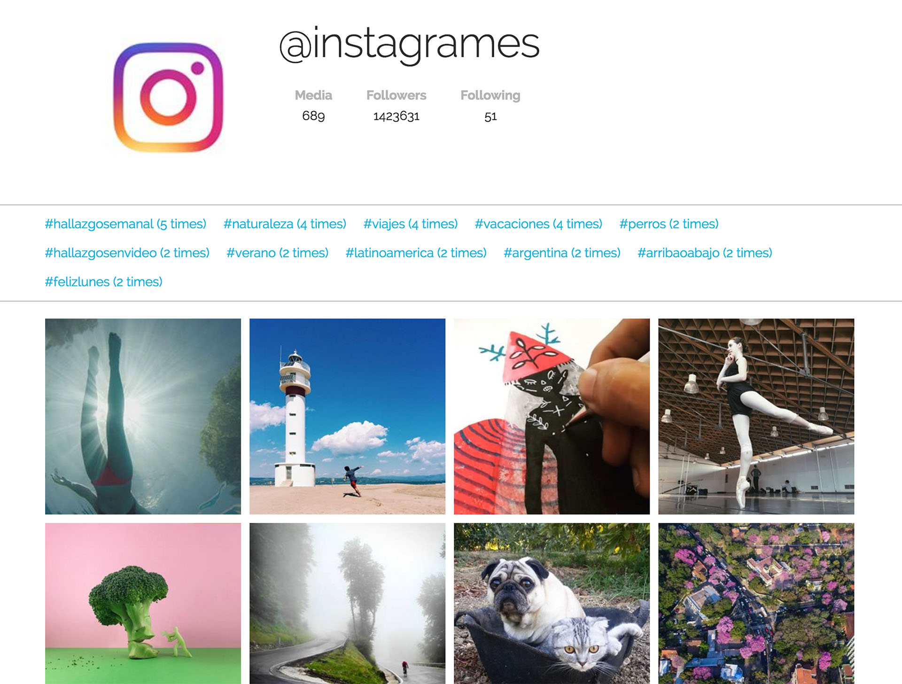

# Instatags

Instatags is a small web app that shows an Instagram account, and provides some stats / filtering functionality for its most frequently used tags.

We have created all the app structure, but the code is not working at all. You need to fix it, editing the `js/main.js` file. Luckily there are comments everywhere to guide you through the code!

## Getting started

To install the required dependencies run `npm install` from the project folder.

Now you can run the `gulp` command from the project folder: this will launch a server that hosts the app, open the browser on the homepage, and automagically reload the page any time you modify a js, html, or css file.

## Tips

This is a quick overview of the project structure. You don’t actually need to touch it, but it could be useful to get an idea of how it works.

- The main view is in `index.html`. This is the file you see in the browser.
- The project’s CSS rules are in `css/main.css`.
- We prepared a minimal utility library to simulate the Instagram API. You don’t need to understand the implementation details ([separation of concerns](https://en.wikipedia.org/wiki/Separation_of_concerns)). On the other hand, if you feel curious go check the file `lib/instagram.js` and read the inline documentation to figure out how it works.

## Extra credits

- Add a first link `#all tags (count)` in the “filter” area, to remove any tag selection and show all images.
- Add [Underscore](http://underscorejs.org/) or [Lodash](https://lodash.com/) via Bower / CDN, and refactor Instatags using the features provided by the library where convenient.
- Make the app [responsive](https://en.wikipedia.org/wiki/Responsive_web_design) (i.e. it should look good on all device sizes).
